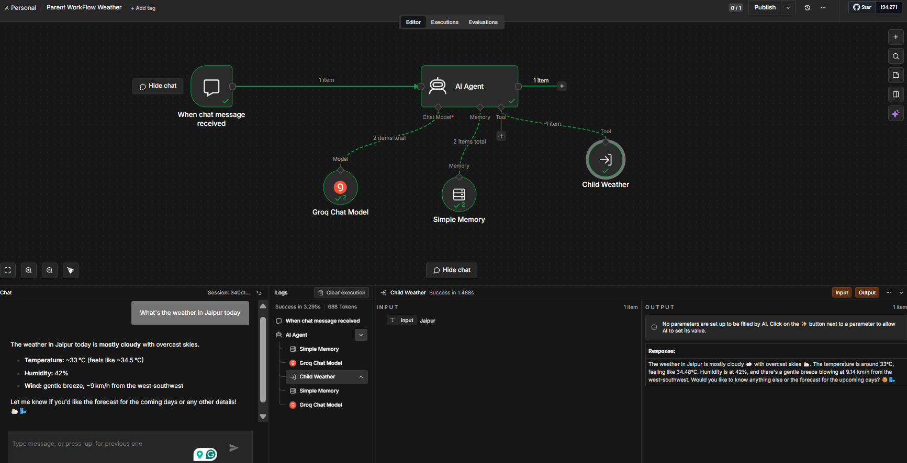
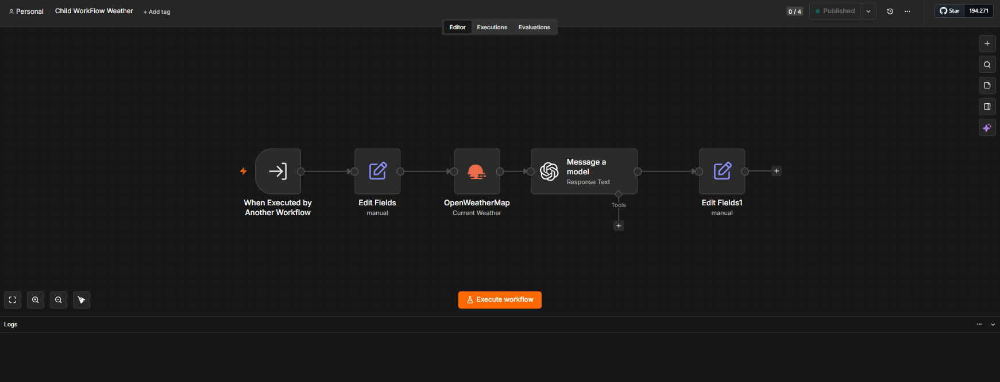

# SkyWeave
An AI-powered weather automation workflow built with n8n. The workflow accepts a city name as input, retrieves real-time weather data from the OpenWeatherMap API, processes the response using an AI model, and returns a human-friendly weather summary.

The project consists of **two connected workflows**:

- **Parent Workflow** – Accepts the user's query, processes it with an AI Agent, and invokes the Child Workflow as a tool.
- **Child Workflow** – Fetches live weather data from OpenWeatherMap, sends it to an AI model for formatting, and returns a clean weather summary.

---

## 🚀 Features

- 🌍 Get real-time weather by city name
- 🤖 AI-powered weather responses
- ☁️ OpenWeatherMap API integration
- 🔗 Parent-Child workflow architecture
- 💬 Conversational weather assistant
- ⚡ Built entirely using n8n
- 🔐 Secure credential management (API keys are not included)
  
---

# 🧩 Workflow Architecture

```
User
   │
   ▼
Parent Workflow
   │
   ▼
AI Agent
   │
   ▼
Child Workflow
   │
   ▼
OpenWeatherMap API
   │
   ▼
AI Model
   │
   ▼
Formatted Weather Response
```

---

# 📸 Workflow Screenshots

## Parent Workflow

```md

```

---

## Child Workflow

```md

```

---

# ⚙️ How It Works

### Parent Workflow

- Receives the user's weather query.
- Uses the AI Agent to understand the request.
- Calls the Child Workflow as a tool.
- Returns the final AI-generated weather response.

---

### Child Workflow

- Receives the city name from the Parent Workflow.
- Calls the OpenWeatherMap API.
- Extracts weather details.
- Sends the data to the AI model.
- Returns a clean, human-friendly response.

---

# 📥 Installation

Clone the repository.

```bash
git clone https://github.com/mithilpaneri07/SkyWeave.git
```

Open your n8n instance.

Import both workflow JSON files.

---

# ▶️ How to Use

> **Important:** Import the workflows in the following order.

## Step 1 — Import the Parent Workflow

Import

```
Parent WorkFlow Weather.json
```

---

## Step 2 — Import the Child Workflow

Import

```
Child WorkFlow Weather.json
```

---

## Step 3 — Configure Credentials

Add your own credentials inside n8n for:

- OpenWeatherMap API
- Groq API
- OpenAI API

---

## Step 4 — Link the Child Workflow

Open the **Parent Workflow**.

Locate the **Child Weather** Tool node.

Select your imported **Child WorkFlow Weather** from the workflow list.

---

## Step 5 — Activate Both Workflows

Activate:

- ✅ Parent Workflow
- ✅ Child Workflow

---

## Step 6 — Test

Open the Parent Workflow Chat.

Ask:

```
What's the weather in Jaipur?
```

The AI will return a natural language weather summary.

---

> API keys are **not included** in this repository.

---

# 📈 Example Response

```
🌤️ Jaipur is currently mostly cloudy.

🌡️ Temperature: 33°C
🤗 Feels Like: 34.5°C
💧 Humidity: 42%
🌬️ Wind Speed: 9 km/h

Have a great day! 😊
```


# 🤝 Contributing

Contributions, suggestions, and improvements are always welcome.

Feel free to fork the repository and submit a pull request.

---
